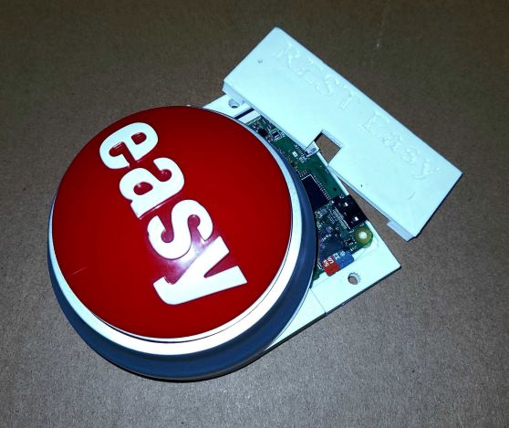

# REST Easy

<p align="center">
  
</p>

# Description
Open Source REST based easy button project for the Raspberry Pi Zero W. Great project for hackers/engineers/students or anyone looking to practice a wide variety of toolsets including soldering, assembly, 3D printing, and web development.

Configure the parameters for an HTTP/HTTPS request through a browser based UI hosted on the Raspberry Pi Zero W and then send that request by hitting the button. Config page HTML is external to docker containers, making it easy to overwrite and give your own custom look.

This request could hit something local on your network like a smart switch/socket directly or more easily through a home automation hub like <a href="https://github.com/home-assistant">Home Assistant</a>

The request could also be used to trigger something external to your network like a Zapier/Integromat webhook or custom code in an AWS lambda.

# Future Enhancements
- Ability to put button in host AP mode to configure wifi settings
- Optional <a href="https://github.com/home-assistant">Home Assistant</a> mode that allows drop down selection for devices/automations
- Mobile app for configuration

# Parts List
1. Easy Button
2. Raspberry Pi Zero W
3. Micro SD Card
4. 4x Standoff Screws
5. 4x m2 Screws
6. 2x Threaded Inserts
7. 2x m3 Screws

# Instructions...Work In Progress - Full tutorial coming soon at link TBD
1. Wire Easy Button to Raspberry Pi Zero W 
2. 3D print and assemble <a href="https://www.tinkercad.com/things/0qxXQGSvE9Z?sharecode=hq_qgz9BtA8mJckSX1Y-pCkFWSxI0rSVLPcXG-DfLVY">Housing</a>
4. Use Raspberry Pi imager to flash PI OS Lite to SD card configuring desired hostname, password, ssh, and network settings
5. SSH into Pi and run (Pi will restart after completion) ```wget https://raw.githubusercontent.com/dielanDaBes/RESTEasy/main/setup.sh && sudo chmod +x setup.sh && ./setup.sh```
6. Edit Docker Compose Settings (Should really only need to update pin settings if not using default pin 13)
7. Docker Compose Up
